# AI Meta descriptions and titles

## Workflow Description

> Created by: Unknown, on 2024-08-30T17:14:28.489Z. Last edited: 2024-08-31T21:01:25.355Z. Status: 🟢 Active. Documentation generated: 2025-01-25T08:02:23.827+03:00.

This workflow is designed to generate SEO-optimized meta descriptions and titles for web pages. It can process either a single page or an entire sitemap. The workflow uses AI to analyze page content and suggest improvements for SEO rankings. It integrates with Airtable to store the generated metadata and provides a webhook for triggering the process. The workflow is divided into two main sections: one for processing a sitemap and another for handling individual pages.

The sitemap processing section starts by fetching the sitemap, parsing the XML, and splitting out the URLs. It then loops through each URL, fetches the page content, and uses AI to generate SEO titles and meta descriptions. These are then stored in Airtable. The single-page processing section is triggered via a webhook, fetches the page content, and follows a similar process to generate and store metadata.

## Workflow schematic

```mermaid
---
config:
  look: neo
  theme: default
---
flowchart LR
    EL1[/Get sitemap/] --> EL2[XML]
    EL2[XML] --> EL3[Split Out]
    EL4[/HTTP Request/] --> EL5[[Code]]
    EL6[Edit Fields] --> EL7[Airtable]
    EL8[Webhook] --> EL19[GET RECORD]
    EL9[/HTTP Request1/] --> EL12[[Code1]]
    EL10[n8n Form Trigger] --> EL11[Edit Fields2]
    EL11[Edit Fields2] --> EL1[/Get sitemap/]
    EL12[[Code1]] --> EL17[SINGLE PAGE META &#43; TITLE]
    EL13[Edit Fields1] --> EL20[UPDATE NEW META &#43; TITLE]
    EL5[[Code]] --> EL18[SITEMAP META &#43; TITLE]
    EL3[Split Out] --> EL14[Loop Over Items]
    EL14[Loop Over Items] --> EL16[Respond to Webhook]
    EL14[Loop Over Items] --> EL14[Loop Over Items]
    EL14[Loop Over Items] --> EL4[/HTTP Request/]
    EL7[Airtable] --> EL15(Wait)
    EL17[SINGLE PAGE META &#43; TITLE] --> EL13[Edit Fields1]
    EL18[SITEMAP META &#43; TITLE] --> EL6[Edit Fields]
    EL19[GET RECORD] --> EL9[/HTTP Request1/]
```

## Nodes Settings

### Get sitemap
  - URL: `={{ $json.Sitemap }}`

### XML
  - No specific parameters configured.

### Split Out
  - Field to split out: `urlset.url`

### HTTP Request
  - URL: `={{ $json.loc }}`

### Code
  - JavaScript code: `// Function to remove all styles from HTML...`

### Edit Fields
  - Assignments:
    - title: `={{ $json.message.content.title }}`
    - Page: `={{ $('Loop Over Items').item.json.loc }}`
    - lastmod: `={{ $('Loop Over Items').item.json.lastmod }}`
    - Meta: `={{ $json.message.content.meta_description }}`

### Airtable
  - Operation: `upsert`
  - Base: `appEanjsKFnMPZZz3`
  - Table: `tbltcRzs27USCCxUL`
  - Columns mapping:
    - SEO Title: `={{ $json.title }}`
    - Page Link: `={{ $json.Page }}`
    - SEO Meta Description: `={{ $json.Meta }}`
    - last modified: `={{ $json.lastmod }}`

### Webhook
  - Path: `ab899ea7-b0f0-44d6-a87f-af9e35e2d22a`
  - Response mode: `lastNode`

### HTTP Request1
  - URL: `={{ $json['Page Link'] }}`

### n8n Form Trigger
  - Path: `generate-new-titles-and-meta-from-sitemap`
  - Form title: `Generate New SEO Titles and Meta Descriptions`
  - Form description: `Submit the page you want to generate the new meta descriptions for`
  - Form fields:
    - Field label: `Enter your sitemap eg https://effibotics.com/post-sitemap.xml`
    - Required: `true`
  - Response mode: `responseNode`

### Edit Fields2
  - Assignments:
    - Sitemap: `={{ $json['Enter your sitemap eg https://effibotics.com/post-sitemap.xml'].startsWith('https://') ? $json['Enter your sitemap eg https://effibotics.com/post-sitemap.xml']  : `https://$json['Enter your sitemap eg https://effibotics.com/post-sitemap.xml']`}}`

### Code1
  - JavaScript code: `// Function to remove all styles from HTML...`

### Edit Fields1
  - Assignments:
    - title: `={{ $json.message.content.title }}`
    - Meta: `={{ $json.message.content.meta_description }}`
    - id: `={{ $('GET RECORD').item.json.id }}`

### Loop Over Items
  - No specific parameters configured.

### Wait
  - No specific parameters configured.

### Respond to Webhook
  - Respond with: `redirect`
  - Redirect URL: `https://airtable.com/appEanjsKFnMPZZz3/tbltcRzs27USCCxUL/viwGMfz8aUVU7LtGY?blocks=hide`

### SINGLE PAGE META + TITLE
  - Model ID: `gpt-4o`
  - Messages:
    - Content: `your task is to create high quality SEO titles and meta descriptions for pages based on the content that we have on the page...`
    - Role: `assistant`
    - Content: `={{ $json.cleanedHtml }}`
    - Role: `system`
  - JSON output: `true`

### SITEMAP META + TITLE
  - Model ID: `gpt-4o`
  - Messages:
    - Content: `your task is to create high quality SEO titles and meta descriptions for pages based on the content that we have on the page...`
    - Role: `assistant`
    - Content: `={{ $json.cleanedHtml }}`
    - Role: `system`
  - JSON output: `true`

### GET RECORD
  - Operation: `get`
  - Base: `appEanjsKFnMPZZz3`
  - Table: `tbltcRzs27USCCxUL`
  - ID: `={{ $json.query.record }}`

### UPDATE NEW META + TITLE
  - Operation: `update`
  - Base: `appEanjsKFnMPZZz3`
  - Table: `tbltcRzs27USCCxUL`
  - Columns mapping:
    - SEO Title: `={{ $json.title }}`
    - SEO Meta Description: `={{ $json.Meta }}`
    - id: `={{ $json.id }}`
