# AI Meta descriptions and titles

## Workflow Overview

> Documentation generated on: 2025-01-25T08:18:04.570+03:00.

This workflow automates SEO optimization by generating meta descriptions and titles for webpages. It processes URLs from a sitemap or single-page input via a form trigger. HTML content is cleaned, analyzed by OpenAI's GPT-4O model, and results are stored in Airtable.

The workflow supports two modes: bulk processing via sitemap XML and single-page updates. Processed data includes page URLs, last modified timestamps, and AI-generated SEO content. Results are mapped to Airtable records using upsert/update operations with field matching.

## Workflow schematic

```mermaid
---
config:
  look: neo
  theme: default
---
flowchart LR
    EL1[/Get sitemap/] --> EL2[XML]
    EL2[XML] --> EL3[Split Out]
    EL4[/HTTP Request/] --> EL5[[Code]]
    EL6[Edit Fields] --> EL7[Airtable]
    EL8[Webhook] --> EL19[GET RECORD]
    EL9[/HTTP Request1/] --> EL12[[Code1]]
    EL10[n8n Form Trigger] --> EL11[Edit Fields2]
    EL11[Edit Fields2] --> EL1[/Get sitemap/]
    EL12[[Code1]] --> EL17[SINGLE PAGE META &#43; TITLE]
    EL13[Edit Fields1] --> EL20[UPDATE NEW META &#43; TITLE]
    EL5[[Code]] --> EL18[SITEMAP META &#43; TITLE]
    EL3[Split Out] --> EL14[Loop Over Items]
    EL14[Loop Over Items] --> EL16[Respond to Webhook]
    EL14[Loop Over Items] --> EL14[Loop Over Items]
    EL14[Loop Over Items] --> EL4[/HTTP Request/]
    EL7[Airtable] --> EL15(Wait)
    EL17[SINGLE PAGE META &#43; TITLE] --> EL13[Edit Fields1]
    EL18[SITEMAP META &#43; TITLE] --> EL6[Edit Fields]
    EL19[GET RECORD] --> EL9[/HTTP Request1/]
```

## Node Configurations

### Get sitemap
  - URL: `={{ $json.Sitemap }}`

### Split Out
  - Field to split: `urlset.url`

### HTTP Request
  - URL: `={{ $json.loc }}`

### Code
  - JavaScript: HTML style stripping function

### Edit Fields
  - Mappings: `title`, `Page`, `lastmod`, `Meta` from AI response

### Airtable
  - Operation: `upsert`
  - Base ID: `appEanjsKFnMPZZz3`
  - Table: `tbltcRzs27USCCxUL`
  - Mapped columns: `SEO Title`, `Page Link`, `SEO Meta Description`, `last modified`

### n8n Form Trigger
  - Form path: `generate-new-titles-and-meta-from-sitemap`
  - Field: `Enter your sitemap eg https://effibotics.com/post-sitemap.xml`

### SINGLE PAGE META + TITLE
  - Model: `gpt-4o`
  - System message: `={{ $json.cleanedHtml }}`
  - Output format: `JSON`

### SITEMAP META + TITLE
  - Model: `gpt-4o`
  - System message: `={{ $json.cleanedHtml }}`
  - Output format: `JSON`

### GET RECORD
  - Operation: `get`
  - Record ID: `={{ $json.query.record }}`

### UPDATE NEW META + TITLE
  - Operation: `update`
  - Mapped columns: `SEO Title`, `SEO Meta Description`, `id`