# AI Meta descriptions and titles

## Workflow Description

> Generated by Imperol on 2025-01-25T08:09:15.945+03:00.

This workflow automates SEO optimization by generating meta descriptions and titles for web pages. It processes sitemaps to extract URLs, fetches page content via HTTP requests, cleans HTML code, and uses AI models to create SEO-friendly metadata. Results are stored in Airtable with page URLs, last modified dates, and generated content.

The workflow supports two modes: batch processing via sitemap URLs and single-page updates through a web form. It includes error handling, loops for bulk processing, and integrations with OpenAI for content generation.

## Workflow schematic

```mermaid
---
config:
  look: neo
  theme: default
---
flowchart LR
    EL1[/Get sitemap/] --> EL2[XML]
    EL2[XML] --> EL3[Split Out]
    EL4[/HTTP Request/] --> EL5[[Code]]
    EL6[Edit Fields] --> EL7[Airtable]
    EL8[Webhook] --> EL19[GET RECORD]
    EL9[/HTTP Request1/] --> EL12[[Code1]]
    EL10[n8n Form Trigger] --> EL11[Edit Fields2]
    EL11[Edit Fields2] --> EL1[/Get sitemap/]
    EL12[[Code1]] --> EL17[SINGLE PAGE META &#43; TITLE]
    EL13[Edit Fields1] --> EL20[UPDATE NEW META &#43; TITLE]
    EL5[[Code]] --> EL18[SITEMAP META &#43; TITLE]
    EL3[Split Out] --> EL14[Loop Over Items]
    EL14[Loop Over Items] --> EL16[Respond to Webhook]
    EL14[Loop Over Items] --> EL14[Loop Over Items]
    EL14[Loop Over Items] --> EL4[/HTTP Request/]
    EL7[Airtable] --> EL15(Wait)
    EL17[SINGLE PAGE META &#43; TITLE] --> EL13[Edit Fields1]
    EL18[SITEMAP META &#43; TITLE] --> EL6[Edit Fields]
    EL19[GET RECORD] --> EL9[/HTTP Request1/]
```

## Nodes Settings

### Get sitemap
  - URL: `={{ $json.Sitemap }}`

### XML
  - No critical configs (default XML parsing)

### Split Out
  - Field to split out: `urlset.url`

### HTTP Request
  - URL: `={{ $json.loc }}`

### Code
  - Custom JavaScript: HTML style stripping function

### Edit Fields
  - Field mappings:
    - title: `={{ $json.message.content.title }}`
    - Page: `={{ $('Loop Over Items').item.json.loc }}`
    - lastmod: `={{ $('Loop Over Items').item.json.lastmod }}`
    - Meta: `={{ $json.message.content.meta_description }}`

### Airtable
  - Operation: `upsert`
  - Base: `appEanjsKFnMPZZz3`
  - Table: `tbltcRzs27USCCxUL`
  - Credentials: `hashed`

### n8n Form Trigger
  - Path: `generate-new-titles-and-meta-from-sitemap`
  - Form field: `Enter your sitemap eg https://effibotics.com/post-sitemap.xml`

### SINGLE PAGE META + TITLE
  - AI Model: `gpt-4o`
  - System prompt: SEO content analysis
  - Credentials: `hashed`

### SITEMAP META + TITLE
  - AI Model: `gpt-4o`
  - System prompt: SEO content analysis
  - Credentials: `hashed`

### GET RECORD
  - Operation: `get`
  - Base: `appEanjsKFnMPZZz3`
  - Table: `tbltcRzs27USCCxUL`
  - Credentials: `hashed`

### UPDATE NEW META + TITLE
  - Operation: `update`
  - Field mappings:
    - SEO Title: `={{ $json.title }}`
    - SEO Meta Description: `={{ $json.Meta }}`
    - id: `={{ $json.id }}`
